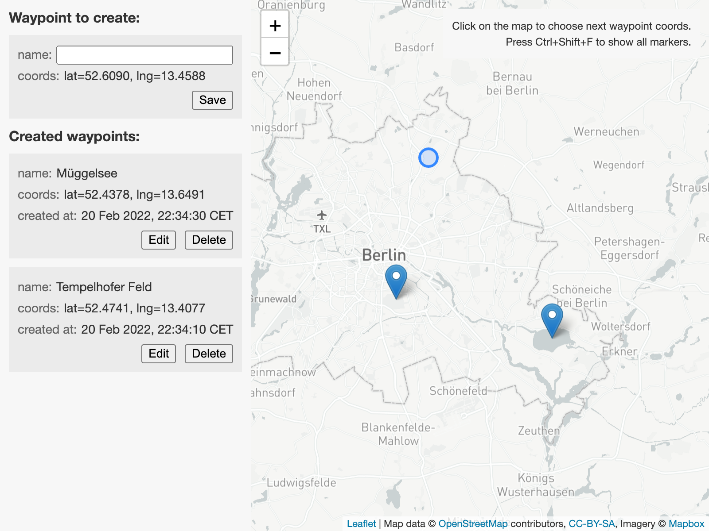

# Waypoints
## Project structure
```bash
# $ tree .
```

## Backend API
```
GET     /waypoints/      Get Waypoint List (latest to earliest)
GET     /waypoints/{id}  Get Waypoint
POST    /waypoints/      Create Waypoint (name and coords)
POST    /waypoints/{id}  Update Waypoint (name only)
DELETE  /waypoints/{id}  Delete Waypoint
```

### Frontend screenshot


## Simplifications
* Repeated worlds are not supported:
  * Backend: `lat in [-90, 90]`, `lng in [-180, 180]` validation is applied.
  * Frontend: no coords wrapping, no markers duplication (default Leaflet behavior).
* Frontend is not containerized, since:
  * Serving prod-bundled static files doesn't require a runtime.
  * Platform-specific differences in build tools binaries don't affect the bundle.
  * There's no CI/CD.
* Credentials are stored in `.env` files, no specific secrets-management.

## Further improvements
### Backend
* Stricter validation, allowing only specified fields.
* Mount a volume to persist DB files.
* Mount a volume to keep/rotate/stream logs, set up more elaborated logging (other than default FastAPI one).
* Set up centralized error reporting, monitoring (other than default Docker tooling) and auto-recovery.
* Functional tests against HTTP methods (with mocked DB).

### Frontend
* Pagination for `GET /waypoints/` (already supported by the API).
* Color-code markers depending on waypoint state: new (not created yet), editing, failed to update/delete.
* Interactivity between sidebar items and map markers, as they represent same waypoints:
  * Highlight on hover:
    * Enlarge the marker.
    * Change sidebar item background color.
  * Select on click:
    * Marker click: scroll the sidebar list to the corresponding item.
    * Sidebar item click: reposition the map on the marker, if it was outside of the viewport.
* More elaborated error handling and reporting, to distinguish and reflect in UI:
  * Network unavailability.
  * Non-2xx API responses.
  * JSON parsing errors.
* Offline mode, allowing to manage waypoint collection locally until network/API becomes available.
* Vertical layout split for smaller screens in portrait mode.
* Storybook stories, component tests, functional tests (with mocked API).

## TODO
### Backend
* Unit tests.
### Frontend
* Unit tests.

## Dependencies
### Backend
#### Containerization
* engine: [Docker](https://docs.docker.com/reference/)

#### DB
* SQL engine/dialect: [PostgreSQL](https://www.postgresql.org/docs/14/index.html)
* spatial extension: [PostGIS](https://postgis.net/docs/)

#### Python env
* env/deps management: [`poetry`](https://python-poetry.org/docs/basic-usage/)

#### App runtime
* ASGI server: [`uvicorn`](https://www.uvicorn.org/)
* app framework: [`fastapi`](https://github.com/tiangolo/fastapi)
* SQL toolkit: [`sqlalchemy`](https://www.sqlalchemy.org/) + [`geoalchemy2`](https://geoalchemy-2.readthedocs.io/)

#### Dev env
* linter: [`pycodestyle`](https://pycodestyle.readthedocs.io/en/latest/)
* unit tests: [`pytest`](https://pytest.org/en/latest/)

### Frontend
#### App runtime
* UI framework: [`react`](https://reactjs.org/docs/)
* map rendering/interactions: [`leaflet`](http://leafletjs.com/)
* CSS class names util: [`classnames`](https://github.com/JedWatson/classnames/)

#### Dev env
* language/compiler: [`typescript`](https://www.typescriptlang.org/docs/)
* bundler: [Create React App](https://create-react-app.dev/)
* linters: [`eslint`](https://eslint.org/) + [`stylelint`](https://stylelint.io/)
* unit tests: [`jest`](https://jestjs.io/)

## Commands
### Backend
```bash
# assumes Docker version "20.10.12"
$ cd ./backend/  # contains ".env" file for docker-compose
$ docker-compose up
# $ docker-compose up --build
# visit http://localhost:8000/docs for Swagger UI

$ docker logs -f <container-id>
$ docker-compose ps -a
$ docker-compose down
$ docker image prune
```

#### DB
```bash
$ docker-compose exec db pg_dump waypoints -U postgres
$ docker-compose exec db psql waypoints postgres
```

#### API
```bash
# lint
$ docker-compose run api poetry run pycodestyle --show-source ./src/

# unit tests
$ docker-compose run api poetry run pytest ./src/
```

### Frontend
```bash
# assumes Node version "17.5.0" and NPM version "8.4.1"
$ npm ci             # install deps
$ npm run lint       # lint TS and Sass
$ npm test           # run unit tests
$ npm start          # run a local CRA dev server
$ npm run build      # produce a build artifact
$ npm run serve      # run a local Python web server in "./build/"
```

## Basic manual tests
### Backend
* GET/POST/DELETE against endpoints via [Swagger UI](http://localhost:8000/docs).

### Frontend
* For layout responsiveness.
* Against backend unavailability/failures and slow network.
* Lighthouse reports, including accessibility recommendations.
